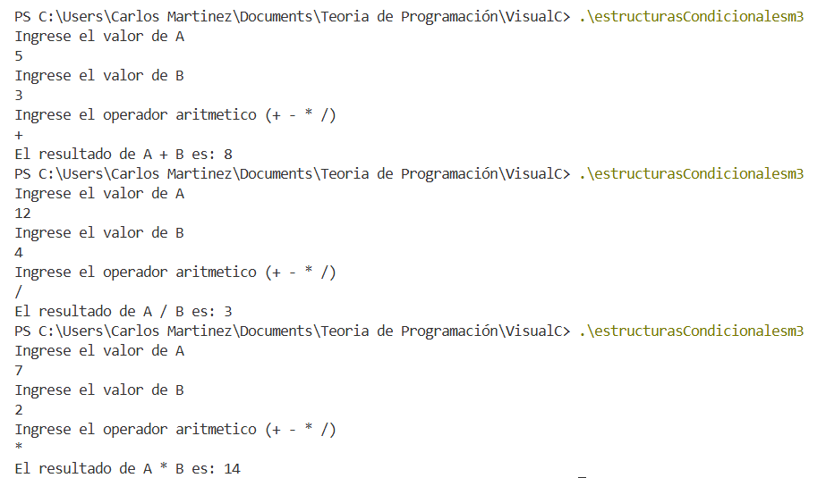

| Caso | A  | B | Operador | Proceso | Resultado |
| ---- | -- | - | -------- | ------- | --------- |
| 1    | 5  | 3 | +        | 5 + 3   | 8         |
| 2    | 12 | 4 | /        | 12 / 4  | 3         |
| 3    | 7  | 2 | *        | 7 * 2   | 14        |

