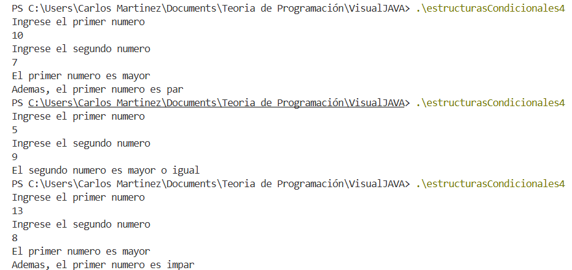

| Caso | A  | B | Proceso                      | Resultado                                |
| ---- | -- | - | ---------------------------- | ---------------------------------------- |
| 1    | 10 | 7 | 10 > 7 → **sí** → 10 % 2 = 0 | “El primer numero es mayor” y “Es par”   |
| 2    | 5  | 9 | 5 > 9 → **no**               | “El segundo numero es mayor o igual”     |
| 3    | 13 | 8 | 13 > 8 → **sí** → 13 % 2 = 1 | “El primer numero es mayor” y “Es impar” |

