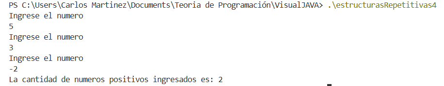

| Iteración | Número ingresado | ¿num > 0? | contador (antes) | contador (después) |
| --------- | ---------------- | --------- | ---------------- | ------------------ |
| 1         | 5                | Sí        | 0                | 1                  |
| 2         | 3                | Sí        | 1                | 2                  |
| 3         | -2               | No        | 2                | 2                  |

