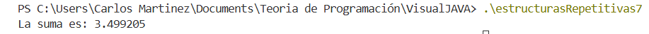

| Iteración | n  | Operación | suma (acumulada) |
| --------- | -- | --------- | ---------------- |
| 1         | 2  | 1/2       | 0.500000         |
| 2         | 3  | 1/3       | 0.833333         |
| 3         | 4  | 1/4       | 1.083333         |
| 4         | 5  | 1/5       | 1.283333         |
| 5         | 6  | 1/6       | 1.449999         |
| ...       | …  | …         | …                |
| 48        | 49 | 1/49      | 3.450143…        |
| 49        | 50 | 1/50      | 3.470143…        |
| 50        | 50 | (fin)     | 3.499205    |

